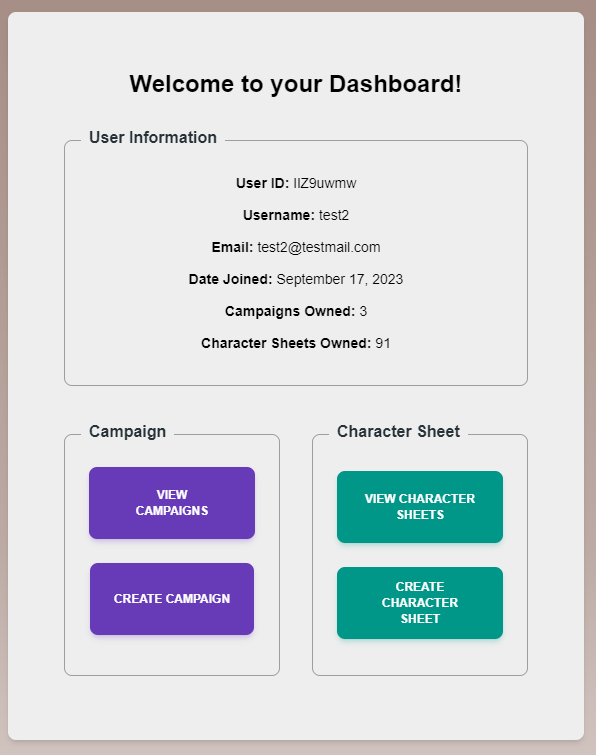

This is a [Next.js](https://nextjs.org/) project bootstrapped with [`create-next-app`](https://github.com/vercel/next.js/tree/canary/packages/create-next-app).

## Table of Contents
- [Description](#description)
- [Tech Stack](#tech-stack)
- [Project Status](#project-status)
- [Screenshots](#screenshots)
- [Future Roadmap](#future-roadmap)
- [Getting Started](#getting-started)
- [License](#license)
- [Acknowledgements](#acknowledgements)

## Description

This web application is a solo-developed and designed, ongoing project that serves as a comprehensive platform for Dungeons and Dragons players and Dungeon Masters, providing tools to create, manage, and view character sheets and campaigns. Built with a modern tech stack including React, Next.js, and Tailwind CSS, the application offers a seamless and interactive user experience.
Table of Contents

## Tech Stack

* Frameworks: React, Next.JS
* UI/Styling: Tailwind, Material UI Tailwind, Framer Motion
* Languages & Linters: TypeScript, ESLint
* Authentication: NextAuth (Traditional login, with plans for OAuth)
* Libraries & Tools: bcrypt, NanoID, Redux + Toolkit + Thunk, Axios, Socket.Io, Formik, Yup, express rate limit micro, validator
* Database: MySQL
* Routing: File-based routing (Next.js)
* Deployment: DigitalOcean
* Logging: Winston, Sentry

## Project Status

The project is currently in active development, with essential packages installed and a ready MySQL schema. The application features a variety of pages and functionalities, including user authentication, character sheet creation, and very basic real-time chat.

**Features**

* Standard User Authentication (Registration, Login, Logout)
* Character Sheet Creation and Viewing
* Campaign Creation and Listing
* Very basic Real-Time Chat
* Basic Alerting System
* Redux Store + Thunk Setup
* MySQL + Schema Setup
* Socket.IO Broadcasting (Currently disabled)

## Screenshots

**Homepage**

The homepage serves as the welcoming point for users, showcasing the essence of our platform with a clean and intuitive design. At the very top, you’ll find a navigation bar featuring the site’s name on the left, providing a strong brand presence. On the right side of the navigation bar, users have quick access to ‘Login’ and ‘Register’ options which change to "Logout" when user logs in. Alongside that, a toggle to switch between dark and light modes. 

Prominently displayed in the center of the page are three main buttons: ‘Login’, ‘Register’, and ‘About’. These provide straightforward navigation for new visitors, guiding them to start their journey or learn more about the platform. The hero banner at the top encapsulates the spirit of the site.

**User Registration Page**

The registration page offers a clean and intuitive interface for new users to sign up. The login page shares a very similar layout. Here's a quick rundown of its features and functionalities:

* Traditional Login System: User credentials are securely stored in a MySQL database.
* Security: Passwords are hashed using bcrypt, ensuring user information is stored safely.
* Unique User Identification: NanoId is used to generate unique IDs for each user.
* Authentication: The platform is powered by NextAuth, paving the way for seamless user authentication experiences.

**Future Implementations:** As the site evolves, there are plans to implement OAuth authentication for accounts like Google and Facebook in the future for even more flexibility and security.

**User Dashboard**

Upon successful login, users are greeted with the Dashboard, designed to provide a snapshot of their account and quick access to the platform's core functionalities. Here's an overview:

* User Information: Clearly displays essential user details like the unique User ID, Username, Email, and Date of Joining. This offers an at-a-glance summary for the user's reference.
* View Campaigns: Allows users to view and manage their existing campaigns in a list. They may then click on an individual campaign to see and edit finer details.
* Create Campaign: A direct link for users to dive into crafting a new campaign, simplifying the process of getting started.
 * View Character Sheets: Users can quickly navigate to view all their character sheets, centralizing their game assets.
 * Create Character Sheet: A hassle-free pathway to begin crafting a new character sheet, ensuring a seamless game setup experience.

**Future Implementations:** While the "Delete Account" button exists, the actual feature is still in the works, indicating our commitment to evolving and adding more user-centric features.

**Campaign Creator**

Embarking on a new adventure? The Campaign Creator is your starting point. Designed with simplicity and functionality in mind, it aims to offer Dungeon Masters and Players an effortless way to set up their next Dungeons and Dragons campaign:

* Campaign Name: A must-have, this field captures the essence of your adventure. As indicated, this field is required to proceed.

* Campaign Description: Give potential players a glimpse into the world you've crafted. Share the plot hooks, settings, or any interesting tidbits that would make them eager to join. This field is also mandatory, ensuring every campaign has a captivating introduction.

* Seamless Integration: Once all details are filled and the "CREATE CAMPAIGN" button is clicked, the magic happens in the background. Your campaign data is securely sent and stored in the database and stored for further use.

**Campaign List**

The Campaign List offers users an organized overview of every campaign they have ever created:

* Campaign Name: The title of your adventure. Use it as a quick reference to distinguish between various campaigns.

* Campaign Code: A unique identifier, automatically assigned to each campaign upon creation. This ID ensures that every campaign can be distinctly identified, even if two campaigns share the same name.

* Date Created: Keeps track when a campaign is created. For future sorting functionality, campaigns can be sorted by date created.
* 
* Delete: With the delete icon, removing a campaign is just a click away. But be cautious – this is a point of no return should the confirm button be pressed.

**Delete Campaign Confirmation**

Upon clicking the delete icon, a safety measure kicks in. The confirmation popup ensures that users are making a deliberate choice when they decide to delete a campaign. This action cannot be undone once confirmed.

**Character Sheet List**

Functionally and visually, a character list and a campaign list share many characteristics. Indeed the component used to generate a campaign list, is the exact same one used to generate a character list, albeit with different fields such as character ID, Name, Level, Class, Date created and the delete icon that behaves in the exact same manner as its campaign counterpart.

**Charactter Creator**

The Character Sheet Creator within the Tabletop Manager is an intuitive and flexible tool designed to streamline the process of setting up a character sheet for Dungeons and Dragons. With its user-centric design, the creator ensures both new and experienced players can effortlessly create and manage their characters.

* Segmented Process: The creation process is divided into various subsections, guiding users through each step of character creation.
* Progress Feedback: The pagination system at the bottom provides clear visual feedback, marking each section with a checkmark upon completion.
* Required & Optional Fields: While the creator emphasizes essential character details (e.g., class, level, name), it also provides optional sections for more detailed character development.
* Quick Setup: The tool prioritizes speed, allowing users to quickly create a character with basic details and fill in more intricate details later. Things like a character's background, gear and items can be filled out at a later date.
* Tooltips: Character creation is often a complex process even for veterans. This creator sports helpful tool tips, marked with an "i" next to the label of each input field that can provide helpful data or reminders of certain D&D rules or stats. Tooltips will be a constant consideration going forward, and as such, more may be added to make the creation experience smooth, quick, and informative.

Once all sections have been filled out and have a checkmark, the final page of the creator is the submission button. If all sections are finished, the button may be clicked and the sheet created and stored. If not, the user has to go back and see which section they missed. Such a process is made easy with the checkmark system in the Pagination bar.

## Future Roadmap

Comprehensive Character Sheet Development

* Detailed Sections: Adding more sections to the character sheet for comprehensive character information.
* Interactive Elements: Implementing interactive elements to calculate and update character stats dynamically where applicable.

Profile Enhancements

* Profile Customization: Allowing users to customize their profiles by uploading images of their characters for their character sheeet and/or their user profile. Ability to change user name.

Socket.IO Full Implementation

* Implement Socket.IO to enable users to view each other's sheets and campaign data in real time as well as have chat functionality down the road.s

Additional Features

* OAuth Integration: Implementing OAuth with NextAuth for more streamlined and secure logins via existing Google or Facebook accounts.
* Mobile Responsiveness: Ensuring the app is fully responsive and provides a great experience on mobile devices.

Performance and Security

* Optimization: Continuously optimizing the application for better performance.
* Security Enhancements: Implementing additional security measures to protect user data.

Deploymment

* When it'll come time for deployment, either Vercel or Digital Ocean will be considered as a host, depending on the overall project state, and completed feature list, as well as expanding the project further beyond the currently listed roadmap.

## Getting Started

To get a local copy up and running, follow these simple steps:

    Clone the repo

    sh

Install NPM packages

sh

npm install

## License

Distributed under the MIT License. See LICENSE for more information.
Contact

Kirill Antipov - kirill.antipov@gmail.com

## Acknowledgements

I would like to express my sincere gratitude to all the developers and contributors of the technologies I've used in this project. Your hard work and dedication have made it possible for developers like me to bring our ideas to life.

* React and Next.js: Thank you for providing the robust frameworks that serve as the backbone of this application, enabling server-side rendering and efficient development practices.
* Tailwind CSS, Material UI Tailwind, and Framer Motion: Your libraries have been instrumental in creating a seamless and visually appealing user interface.
* TypeScript: Thank you for adding type safety to JavaScript, making the codebase more robust and maintainable.
* ESLint: Your tool has been invaluable in maintaining code quality and consistency throughout the project.
* NextAuth.js: For providing a secure and easy-to-implement authentication solution.
* bcrypt, NanoID, Redux, Redux Toolkit, Redux Thunk, Axios, Socket.IO, Formik, Yup, express-rate-limit, micro, validator: Each of these libraries and tools has played a crucial role in various functionalities of the application, from security to state management, and data validation.
* MySQL: For providing a reliable and scalable database solution.
* Winston: For assisting in implementing comprehensive logging throughout the application, ensuring that any issues can be quickly identified and resolved.

And last but not least, a huge thank you to GitHub for hosting the code and providing a platform for version control.

Your contributions to the open-source community are invaluable, and this project would not have been possible without your efforts.
